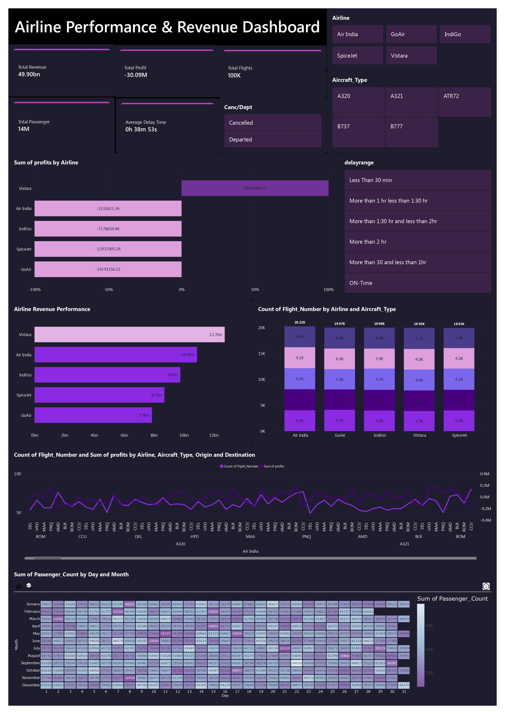

# ✈ Airline Operations & Profitability Analysis Dashboard

## 📊 Project Overview
This project presents an end-to-end analysis of airline operations and profitability using Power BI and Python.  
The objective is to evaluate airline performance by analyzing revenue trends, delays, cancellations, passenger traffic, and overall profitability to generate actionable business insights.

The interactive dashboard enables stakeholders to monitor key performance indicators (KPIs), identify operational inefficiencies, and support data-driven decision-making in the aviation sector.

---

## 🎯 Business Objectives
- Analyze airline revenue and profitability trends
- Identify top and low performing airlines
- Evaluate delay and cancellation impact on operations
- Monitor passenger and flight trends
- Provide insights for improving operational efficiency

---

## 🛠 Tools & Technologies Used
- Power BI – Dashboard creation & visualization  
- Python (Pandas, Matplotlib) – Data cleaning & analysis  
- Excel / CSV – Data source  
- Data Visualization & KPI analysis  

---

## 📷 Dashboard Preview

---

## 📈 Key Insights
- Vistara generated the highest revenue among airlines
- Some airlines showed negative profit due to higher operational costs
- Flight delays directly impacted profitability and performance
- Passenger trends varied monthly, affecting revenue
- Comparative airline analysis highlighted performance gaps

---

## 💡 Skills Demonstrated
- Data Cleaning & Preprocessing  
- Exploratory Data Analysis (EDA)  
- Dashboard Design (Power BI)  
- Business Insight Generation  
- Data Storytelling  

